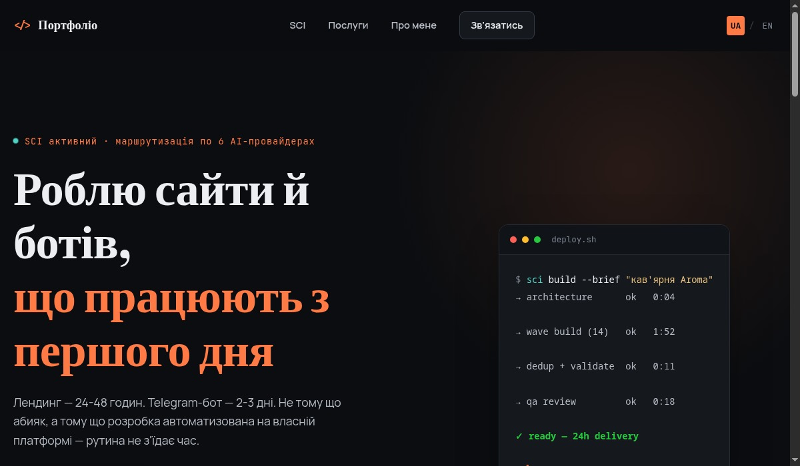

<h1 align="center">Ivan</h1>

Веб-розробка · Telegram-боти · AI-інтеграції — на власній платформі SCI

  <a href="https://neurallabs753-commits.github.io/portfolio/">Портфоліо</a> ·
  <a href="https://www.fiverr.com/s/Ay95roP">Fiverr</a> ·
  <a href="https://t.me/NeuralMrIvan">Telegram</a>

---

## Що я роблю

Лендинги за 24-48 годин, Telegram-боти за 2-3 дні, AI-асистенти — не тому що абияк, а тому що рутина автоматизована на власній платформі SCI. Кожен проєкт я особисто перевіряю перед здачею.

## Живі проєкти

<table>
<tr>
<td width="50%">

**[Портфоліо-сайт](https://neurallabs753-commits.github.io/portfolio/)**
 Ручний HTML/CSS/JS, без конструкторів. Анімація, мультимовність, повна адаптивність.

</td>
<td width="50%">

**[Aroma Café — лендинг кав'ярні](https://neurallabs753-commits.github.io/aroma-cafe-landing/)**
 Концепт-проєкт: інтерактивне меню, форма бронювання, SEO-розмітка. Перевірено живим headless-браузером.

</td>
</tr>
</table>

## SCI — платформа, на якій це все побудовано

Нейронками я цікавився ще з часів першого ChatGPT. На початку 2024 почав реально розбиратись, як воно працює під капотом. Тоді у мене був лише старий ноут з Radeon-відеокартою 2021 року — про локальні нейронки на ньому можна було забути.

Наприкінці 2024 купив свій перший ПК — RTX 3050, 8 ГБ. Для локальних нейронок цього мало, але саме тоді мені сподобався Cursor, і я вирішив спробувати зробити щось подібне сам.

**Початок був скромний**: невеликий AI-асистент для себе. Побачив хайп навколо агентів — розширив функціонал. Зібрав першу повноцінну тестову версію, почав додавати функції одну за одною — а коли розрослось до 10-15 тисяч рядків, почав зрізати зайве і переписувати половину бекенда наново. Паралельно пів року намагався витиснути з локальних моделей на 3050 хоч щось притомне — максимальний приріст продуктивності за весь цей час склав 10-15%. Стало зрозуміло: потрібен інший підхід.

Потім знайшов безкоштовні онлайн-моделі з лімітами — і зміг зробити першого реального мультиагента, який писав нормальний код і адекватно шукав інформацію. Підключив кілька акаунтів паралельно — вийшла мультиагентна система, що працює одночасно з десятками моделей, рідко впираючись у ліміти.

**Що реально працює зараз**: повноцінна кодерська мультиагентна система, пам'ять, база даних, робота з терміналом, генерація зображень, керування через Telegram/Discord-ботів.

**Що ще не стабільно (чесно)**: режим автопілота (система сама керує застосунками) і голосовий асистент Jarvis — обидва існують, але працюють з перебоями.

**Далі**: платні API — Claude Code, Codex, моделі OpenAI/Anthropic. Починаю з DeepSeek і найдешевшої моделі Claude.

---

Веб-розробка, боти, AI-інтеграції — <a href="https://www.fiverr.com/s/Ay95roP">fiverr.com/s/Ay95roP</a>

