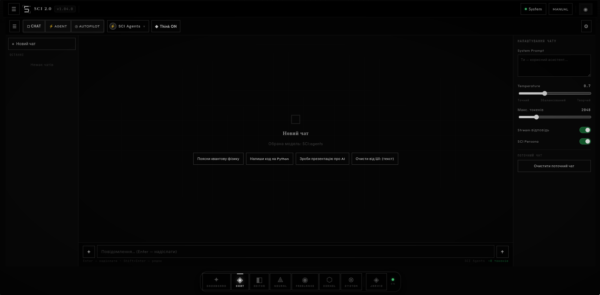
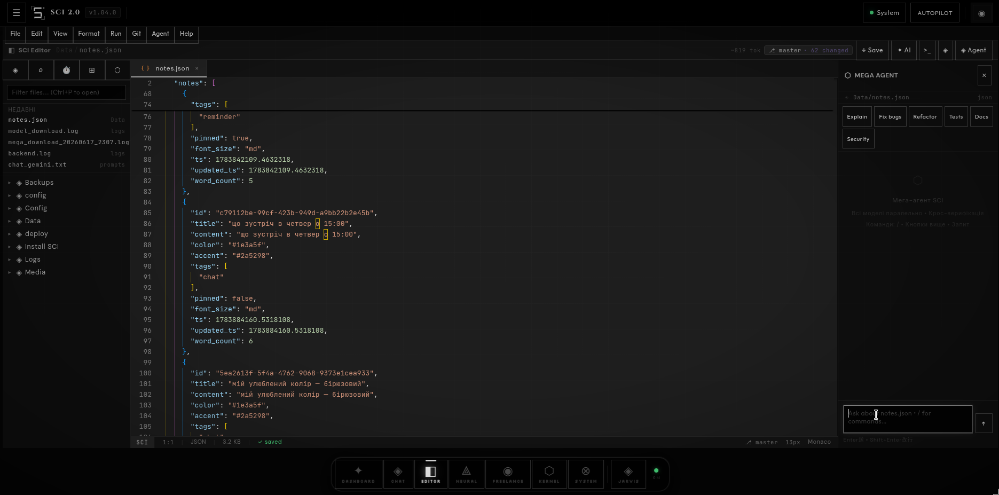
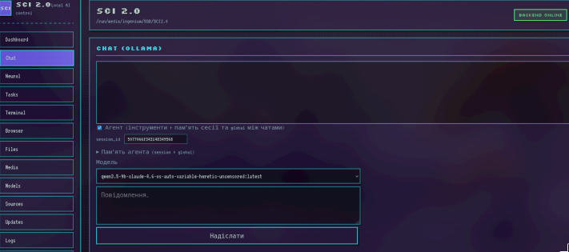
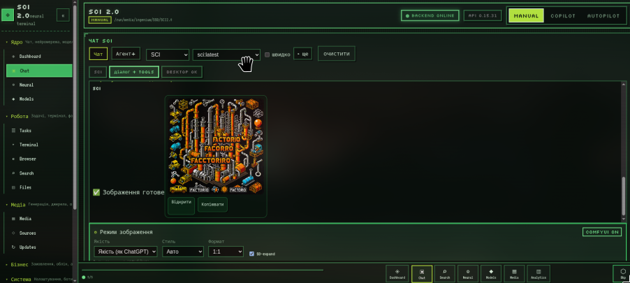
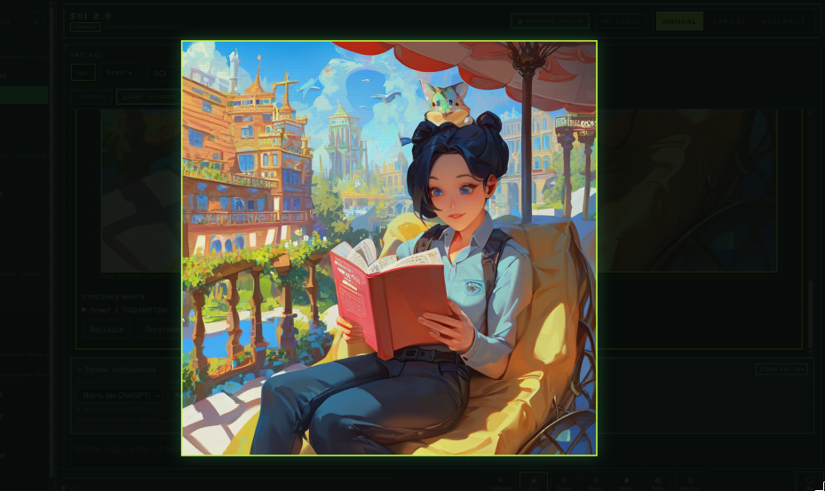

<h1 align="center">SCI</h1>

Web development · Telegram bots · AI integrations — my own automated platform, run by Ivan

  <a href="https://neurallabs753-commits.github.io/portfolio/">Portfolio</a> ·
  <a href="https://www.fiverr.com/s/Ay95roP">Fiverr</a> ·
  <a href="https://t.me/NeuralMrIvan">Telegram</a>

---

## SCI — the platform behind all of this

<table>
<tr>
<td width="33%">

Main chat — model/agent selection, live token stream, per-chat System Prompt and temperature controls.

</td>
<td width="33%">

Kernel building the actual Aroma Café landing page — 8 agents in parallel, 284 lines, ready.

</td>
<td width="33%">

Built-in editor with an AI agent panel — explain, fix bugs, refactor, generate tests/docs, security review.

</td>
</tr>
</table>

I've been interested in neural networks since the first ChatGPT. Early 2024, I started actually digging into how it works under the hood. At the time I only had an old laptop with a 2021 Radeon GPU — local models were out of the question.

By late 2024 I bought my first real PC — an RTX 3050, 8GB. Still not enough for serious local models, but around then I got into Cursor and decided to try building something like it myself.

**It started small**: a modest personal AI assistant. Then I saw the hype around agents and expanded the scope. Built a first full working version, kept adding features one by one — by 10-15k lines it had grown enough that I started cutting things back down, rewriting half the backend more than once. In parallel, I spent about six months trying to squeeze anything usable out of local models on the 3050 — best case, a 10-15% performance gain. That alone made it clear a different approach was needed.

 ~40k lines in — the most polished the local-only version ever got, right before I gave up on squeezing more out of the 3050.

Then I found free-tier online models with rate limits — and built my first real multi-agent setup that could write actual working code and do reasonably competent research. Connected several accounts in parallel, and it became a real multi-agent system running across dozens of models at once, rarely hitting limits.

**What actually works today**: a full multi-agent coding system, memory, a database layer, terminal access, image generation, Telegram/Discord bot control.

<table>
<tr>
<td width="50%">

~55-60k lines — image generation through a connected ComfyUI: the model writes its own prompt, picks LoRAs/checkpoints/ControlNet, and generates.

</td>
<td width="50%">

Same pipeline, a cleaner result — same session, no manual prompt engineering on my end.

</td>
</tr>
</table>

**What's still rough (honestly)**: an autopilot mode (the system driving apps on its own) and a voice assistant, Jarvis — both exist, both still work inconsistently.

**Next**: paid APIs — Claude Code, Codex, OpenAI/Anthropic models. Starting with DeepSeek and the cheapest Claude tier.

## What I'm building next

Extending things that already partially exist in SCI:

| Feature | What it does |
|---|---|
| **Transparent task cost** | SCI predicts the token budget and cost before starting, then shows real spend after — no after-the-fact surprises |
| **Background security scanning** | A dedicated agent continuously checks generated code for vulnerabilities (SQL injection, XSS, hardcoded secrets) |
| **Self-updating docs** | Documentation that regenerates itself whenever the underlying code changes |
| **Overnight autonomous work queue** | Hand off a task list before bed, wake up to a real report — what got done, what got stuck, and why (needs paid models, a bigger API budget, and a carefully tuned prompt — not reliable on the free tier) |
| **Explainable routing** | Ask "why this model, why this approach" on any answer and get a real, traced reason — not a brush-off |

Bigger, further out:

| Feature | What it does |
|---|---|
| **Multi-model consensus** | Critical code gets written independently by 2-3 models, then a fourth compares and picks the best version |
| **Voice-driven coding** | Describe a feature out loud — it lands in the code, with a checkpoint to roll back |
| **A/B design variants** | One brief, 2-3 real design directions generated up front — client picks, instead of waiting on revisions |
| **Reuse of proven solutions** | SCI recognizes when a new task resembles past work and reuses a tested component instead of reinventing it |

---

## What I do

Landing pages in 24-48 hours, Telegram bots in 2-3 days, AI assistants — not because it's rushed, but because the routine work runs on my own automated platform, SCI. I personally review every project before delivery.

## Live project

<table>
<tr>
<td width="60%">

**[Portfolio site](https://neurallabs753-commits.github.io/portfolio/)**
 I build quality, fully responsive websites. Custom intro animation, full i18n (UA/EN).

</td>
</tr>
</table>

---

Web development, bots, AI integrations — <a href="https://www.fiverr.com/s/Ay95roP">fiverr.com/s/Ay95roP</a>

